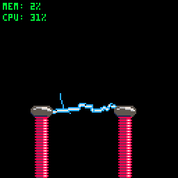

# Tesla's Birthday Coils

Created Approx 7th July 2019

Author James Brown

Rapidly-exploring Random Tree (RRT) is a simple and effective method of pathfinding. It involves generating a random point in n-dimensional space (in this case, 2d space), and taking a linear step in the direction of that point from the nearest previously connected point. The new point in a linear step from an existing point is checked, to see if the point is in valid space, eg, not inside an obstacle. By sometimes (but not every time) generating the desired point at a given goal, then the algorithm will eventually connect a line from a starting position to a goal, while exploring around obstacles along the way.

In 2D, if large enough steps are taken, then a path can quickly be found between start position and end position - especially if there are no obstacles in the way. If a path can be found quick enough then a potential path can be drawn from A to B every frame. If ALL paths are drawn, and not just the shortest path from start to finish, then the path can be seen to fork, resembling lightning.

This effect can be amplified by drawing the shortest path with a thicker line. The start position is one coil, while the goal position is another coil. In theory, this effect could be used to dynamically arc lightning between multiple points, while avoiding non-conductive obstacles.

Since I discovered this effect on the 7th of July, I decided to honour this demonstration towards the birthday of the great inventor, Nikola Tesla, born 10th July 1856.

